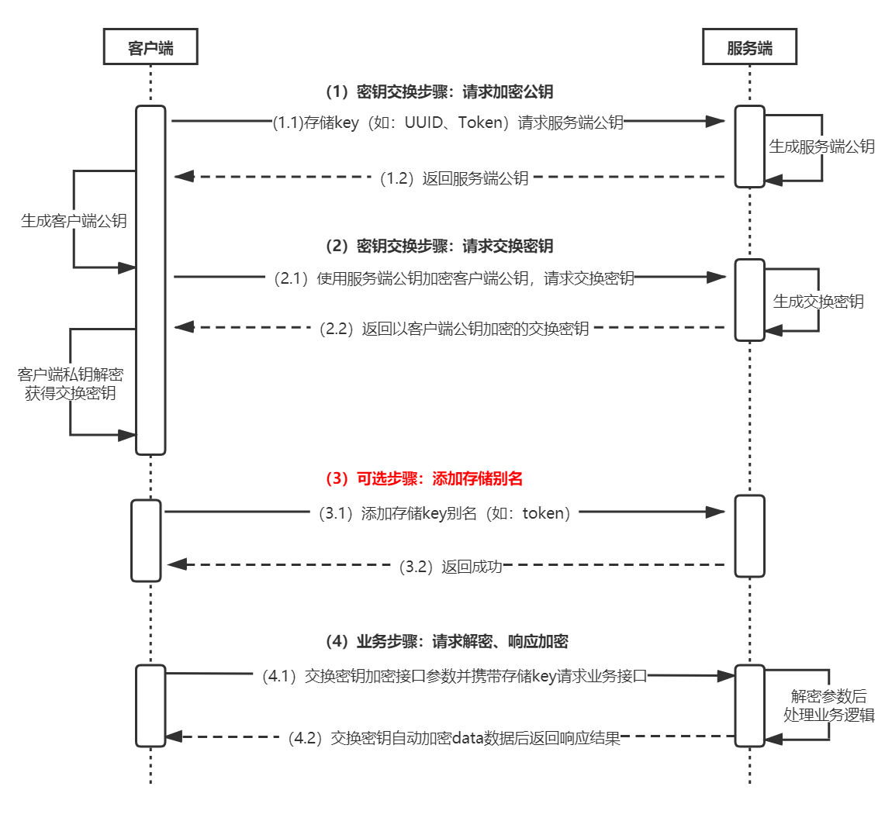

# 密钥交换
密钥交换加密可以实现如下几个特性：
- 每次会话的密钥时随机的，客户端与服务端事先无需约定
- 密钥未直接存储在客户端与服务端中，避免了泄露风险
- 密钥交换过程中，密钥的传输是加密的

## 密钥交换流程


**密钥交换步骤一：客户端请求传输加密公钥**
1. 客户端使用密钥存储key，请求获得服务端公钥（用于步骤二请求加密）
 - 密钥存储key：作为会话唯一键，在步骤一、步骤二、步骤三中属于必填参数
 - 密钥存储key：在用户未登录时一般会随机生成一个UUID，用户登陆后再用token作为别名
 - 密钥存储key：用户已登录情况，一般会以用户本次会话token作为存储key
2. 服务端收到请求后，生成用于后续传输加解密的公私钥并绑定存储key
3. 服务端将生成的公钥返回给客户端

**密钥交换步骤二：客户端请求最终交换密钥**
1. 客户端获得服务端的公钥后，创建客户端自身的公私钥
2. 客户端使用**服务端的公钥**加密**自身生成的公钥**，向服务端请求最终的交换密钥
3. 服务端使用私钥解密获得客户端公钥
4. 服务端生成最终交换密钥，并使用客户端公钥进行响应加密
5. 客户端获得加密的交换密钥后使用**客户端私钥解密**，获得交换密钥

**密钥交换步骤三（可选）：客户端为服务端密钥的存储key添加别名**
- 适用场景：
 - 步骤一时用户未登录，使用临时的UUID作为服务端密钥存储key，用户登录后想使用token作为密钥存储key，方便后续传输

**使用交换密钥加解密**
1. 客户端获得交换密钥后，请求需要参数加密的接口时，以约定的方式带上密钥存储key，并加密请求参数
 - 约定方式：默认为OAuth2 Token认证，故：若步骤一使用UUID作为存储key，需将token添加为存储别名
 - 约定方式：除默认方式外支持：Header传参约定、URL Param传参约定（具体传参key为服务端定义，默认key值：`Yue-ExchangeKey-StorageKey`）
2. 服务端解密参数处理业务逻辑后，使用`@ResponseEncrypt`注解自动加密响应的data参数
3. 客户端解密响应结果

## 接口说明
**默认算法名称**
- RSA_AES：
```java
	/** RSA算法，此算法用了默认补位方式为RSA/ECB/PKCS1Padding */
	RSA_ECB_PKCS1("RSA/ECB/PKCS1Padding"), 

	/** 默认的AES加密方式：AES/ECB/PKCS5Padding */
	AES("AES"), 
```

- SM2_SM4
```java
	/**
	 * 算法EC
	 */
	private static final String ALGORITHM_SM2 = "SM2";
	
	public static final String ALGORITHM_NAME = "SM4";
```

**密钥交换-第一步：获得加密公钥**
> 接口地址：POST /open/v2.3/keyExchange/{storageKey}

|参数			|说明									|参数示例							|
|--				|--										|--									|
|storageKey		|RESTful路径参数，密钥存储key			|23ef1f9418e84cc884187e1720ac1529	|
|exchangeKeyType|交换密钥类型，枚举值：RSA_AES、SM2_SM4	|RSA_AES							|

**密钥交换-第二步：获得交换密钥**
> 接口地址：POST /open/v2.3/keyExchange/{storageKey}

|参数						|说明											|参数示例										|
|--							|--												|--												|
|storageKey					|RESTful路径参数，密钥存储key					|23ef1f9418e84cc884187e1720ac1529				|
|exchangeKeyType			|交换密钥类型，枚举值：RSA_AES、SM2_SM4			|RSA_AES										|
|encryptedClientPublicKey	|使用服务端公钥加密的客户端公钥（encryptBase64）|`SsowXMaZfQiec39  ..略n..  uv/DbVr6gslrjY3Q==`	|

**密钥交换-第三步：添加存储key别名**
> 接口地址：POST /open/v2.3/keyExchange/{storageKey}/addAlias

|参数			|说明							|参数示例							|
|--				|--								|--									|
|storageKey		|RESTful路径参数，密钥存储key	|23ef1f9418e84cc884187e1720ac1529	|
|storageKeyAlias|存储别名						|cbf55767c47e4d4e9feb90cfa2bdf5aa	|

## 配置
```java
yue: 
  crypto:
    key-exchange:
      enabled: true # 默认false，启用密钥交换
      key-exchange-storage-type: redis # 使用redis作为密钥交换存储类型
```

## 注解使用说明
`@RequestDecrypt`请求解密注解：
- 必须与`@RequestBody`注解一同使用
- `@RequestBody`注解只支持使用Body传参，并映射为实体参数。
- `Content-Type=application/json;charset=UTF-8`
```java
    @RequestDecrypt
    @PostMapping("/decrypt")
    public Result<?> decrypt(@RequestBody UserIPO userIPO) {
        return R.success(userIPO);
    }
```

`@ResponseEncrypt`响应加密注解：
- 必须与`@ResponseBody`注解一同使用，`@RestController`注解默认已集成`@ResponseBody`
- 必须使用`Result`作为返回类型，并且加密的是data参数
```java
    @ResponseEncrypt
    @GetMapping("/{encrypt}")
    public Result<?> encrypt(@PathVariable String encrypt) {
        return R.success(encrypt);
    }
```